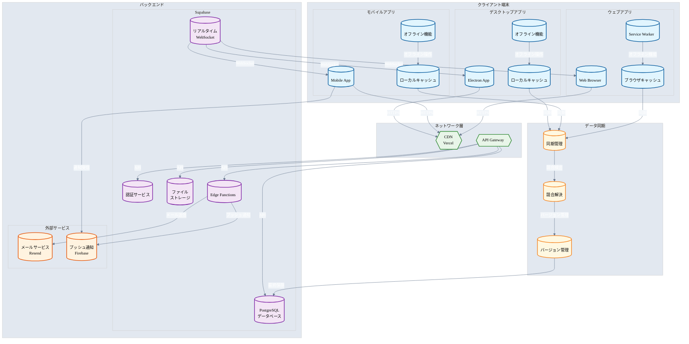
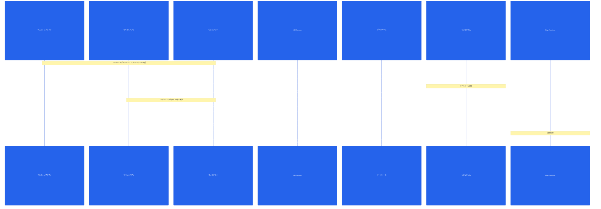
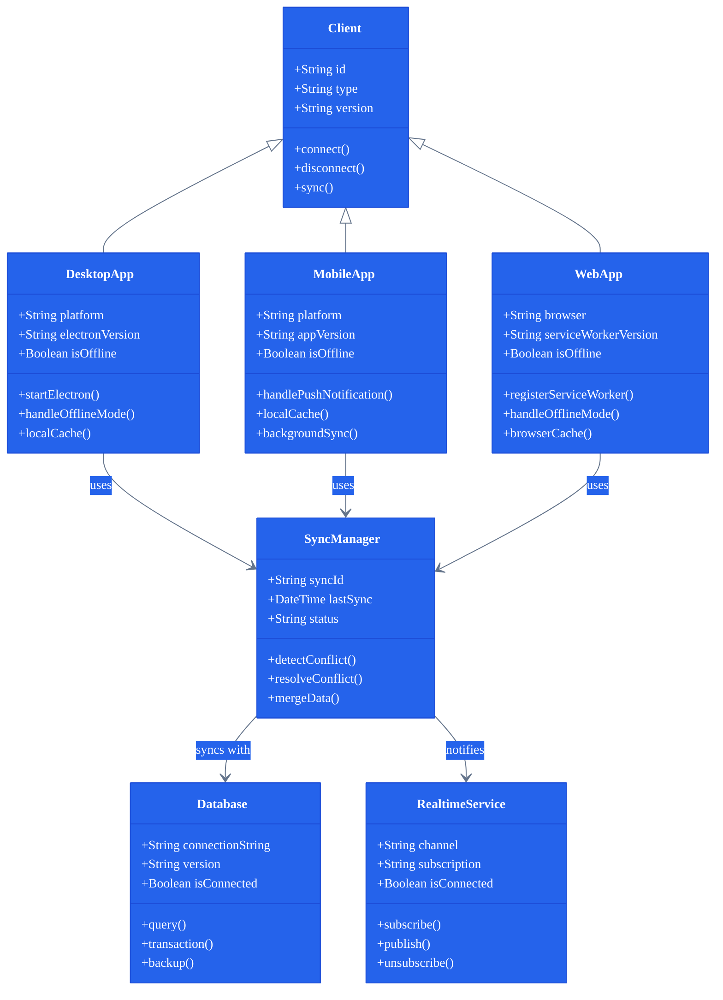

# 最適化されたMermaid図

## データフロー図（最適化版）

```mermaid
%%{init: {
  'theme': 'base',
  'themeVariables': {
    'primaryColor': '#2563eb',
    'primaryTextColor': '#ffffff',
    'primaryBorderColor': '#1d4ed8',
    'lineColor': '#64748b',
    'secondaryColor': '#f1f5f9',
    'tertiaryColor': '#e2e8f0',
    'fontFamily': 'Hiragino Sans, Arial, sans-serif',
    'fontSize': '14px'
  },
  'flowchart': {
    'curve': 'basis',
    'padding': 20,
    'nodeSpacing': 50,
    'rankSpacing': 50
  }
}}%%
flowchart TB
    %% スタイル定義
    classDef clientStyle fill:#e1f5fe,stroke:#01579b,stroke-width:2px,color:#000
    classDef networkStyle fill:#e8f5e8,stroke:#388e3c,stroke-width:2px,color:#000
    classDef backendStyle fill:#f3e5f5,stroke:#7b1fa2,stroke-width:2px,color:#000
    classDef syncStyle fill:#fff8e1,stroke:#f57f17,stroke-width:2px,color:#000
    classDef externalStyle fill:#fff3e0,stroke:#e65100,stroke-width:2px,color:#000
    
    %% クライアント端末
    subgraph CLIENT["クライアント端末"]
        subgraph DESKTOP["デスクトップアプリ"]
            DA[("Electron App")]
            DA_Cache[("ローカルキャッシュ")]
            DA_Offline[("オフライン機能")]
        end
        
        subgraph MOBILE["モバイルアプリ"]
            MA[("Mobile App")]
            MA_Cache[("ローカルキャッシュ")]
            MA_Offline[("オフライン機能")]
        end
        
        subgraph WEB["ウェブアプリ"]
            WA[("Web Browser")]
            WA_Cache[("ブラウザキャッシュ")]
            WA_SW[("Service Worker")]
        end
    end
    
    %% ネットワーク層
    subgraph NETWORK["ネットワーク層"]
        CDN{{"CDN<br/>Vercel"}}
        API{{"API Gateway"}}
    end
    
    %% バックエンド
    subgraph BACKEND["バックエンド"]
        subgraph SUPABASE["Supabase"]
            AUTH[("認証サービス")]
            DB[("PostgreSQL<br/>データベース")]
            REALTIME[("リアルタイム<br/>WebSocket")]
            STORAGE[("ファイル<br/>ストレージ")]
            FUNCTIONS[("Edge Functions")]
        end
        
        subgraph EXTERNAL["外部サービス"]
            EMAIL[("メールサービス<br/>Resend")]
            NOTIFICATION[("プッシュ通知<br/>Firebase")]
        end
    end
    
    %% データ同期
    subgraph SYNC["データ同期"]
        SYNC_MGR[("同期管理")]
        CONFLICT[("競合解決")]
        VERSION[("バージョン管理")]
    end
    
    %% 接続関係
    %% クライアントからネットワーク
    DA -->|HTTPS| CDN
    MA -->|HTTPS| CDN
    WA -->|HTTPS| CDN
    
    %% ネットワークからバックエンド
    API -->|API| AUTH
    API -->|API| DB
    API -->|API| STORAGE
    API -->|API| FUNCTIONS
    
    %% リアルタイム接続
    REALTIME -->|WebSocket| DA
    REALTIME -->|WebSocket| MA
    REALTIME -->|WebSocket| WA
    
    %% データ同期
    DA_Cache -->|同期| SYNC_MGR
    MA_Cache -->|同期| SYNC_MGR
    WA_Cache -->|同期| SYNC_MGR
    
    SYNC_MGR -->|競合検出| CONFLICT
    CONFLICT -->|バージョン管理| VERSION
    VERSION -->|最終保存| DB
    
    %% オフライン機能
    DA_Offline -->|オフライン操作| DA_Cache
    MA_Offline -->|オフライン操作| MA_Cache
    WA_SW -->|オフライン機能| WA_Cache
    
    %% 通知・メール
    FUNCTIONS -->|メール送信| EMAIL
    FUNCTIONS -->|プッシュ通知| NOTIFICATION
    MA -->|通知受信| NOTIFICATION
    
    %% スタイル適用
    class DA,DA_Cache,DA_Offline,MA,MA_Cache,MA_Offline,WA,WA_Cache,WA_SW clientStyle
    class CDN,API networkStyle
    class AUTH,DB,REALTIME,STORAGE,FUNCTIONS backendStyle
    class SYNC_MGR,CONFLICT,VERSION syncStyle
    class EMAIL,NOTIFICATION externalStyle
```

## シーケンス図（最適化版）

```mermaid
%%{init: {
  'theme': 'base',
  'themeVariables': {
    'primaryColor': '#2563eb',
    'primaryTextColor': '#ffffff',
    'primaryBorderColor': '#1d4ed8',
    'lineColor': '#64748b',
    'secondaryColor': '#f1f5f9',
    'tertiaryColor': '#e2e8f0',
    'fontFamily': 'Hiragino Sans, Arial, sans-serif',
    'fontSize': '14px'
  },
  'sequence': {
    'width': 800,
    'height': 600,
    'boxMargin': 10,
    'boxTextMargin': 5,
    'noteMargin': 10,
    'messageMargin': 35,
    'mirrorActors': true,
    'bottomMarginAdj': 1,
    'useMaxWidth': true,
    'rightAngles': false,
    'showSequenceNumbers': false
  }
}}%%
sequenceDiagram
    participant DA as デスクトップアプリ
    participant MA as モバイルアプリ
    participant WA as ウェブアプリ
    participant API as API Gateway
    participant DB as データベース
    participant RT as リアルタイム
    participant FN as Edge Functions
    
    Note over DA,WA: ユーザーAがデスクトップでプロジェクトを更新
    
    DA->>API: プロジェクト更新リクエスト
    API->>DB: データベース更新
    DB-->>API: 更新完了
    API-->>DA: 更新成功レスポンス
    
    Note over RT: リアルタイム通知
    
    RT->>MA: プロジェクト更新通知
    RT->>WA: プロジェクト更新通知
    
    Note over MA,WA: ユーザーBとCが即座に更新を確認
    
    MA->>API: 最新データ取得
    WA->>API: 最新データ取得
    API->>DB: データ取得
    DB-->>API: 最新データ
    API-->>MA: データ返却
    API-->>WA: データ返却
    
    Note over FN: 通知処理
    
    FN->>MA: プッシュ通知送信
    FN->>DA: メール通知送信
```

## クラス図（最適化版）

```mermaid
%%{init: {
  'theme': 'base',
  'themeVariables': {
    'primaryColor': '#2563eb',
    'primaryTextColor': '#ffffff',
    'primaryBorderColor': '#1d4ed8',
    'lineColor': '#64748b',
    'secondaryColor': '#f1f5f9',
    'tertiaryColor': '#e2e8f0',
    'fontFamily': 'Hiragino Sans, Arial, sans-serif',
    'fontSize': '14px'
  }
}}%%
classDiagram
    class Client {
        +String id
        +String type
        +String version
        +connect()
        +disconnect()
        +sync()
    }
    
    class DesktopApp {
        +String platform
        +String electronVersion
        +Boolean isOffline
        +startElectron()
        +handleOfflineMode()
        +localCache()
    }
    
    class MobileApp {
        +String platform
        +String appVersion
        +Boolean isOffline
        +handlePushNotification()
        +localCache()
        +backgroundSync()
    }
    
    class WebApp {
        +String browser
        +String serviceWorkerVersion
        +Boolean isOffline
        +registerServiceWorker()
        +handleOfflineMode()
        +browserCache()
    }
    
    class SyncManager {
        +String syncId
        +DateTime lastSync
        +String status
        +detectConflict()
        +resolveConflict()
        +mergeData()
    }
    
    class Database {
        +String connectionString
        +String version
        +Boolean isConnected
        +query()
        +transaction()
        +backup()
    }
    
    class RealtimeService {
        +String channel
        +String subscription
        +Boolean isConnected
        +subscribe()
        +publish()
        +unsubscribe()
    }
    
    Client <|-- DesktopApp
    Client <|-- MobileApp
    Client <|-- WebApp
    
    DesktopApp --> SyncManager : uses
    MobileApp --> SyncManager : uses
    WebApp --> SyncManager : uses
    
    SyncManager --> Database : syncs with
    SyncManager --> RealtimeService : notifies
``` 