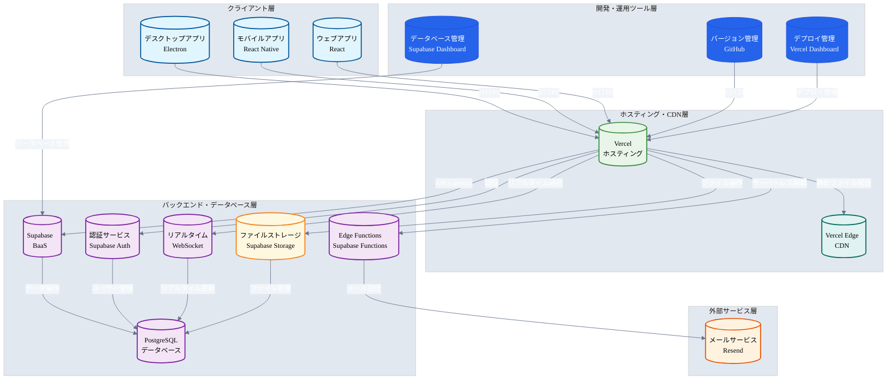
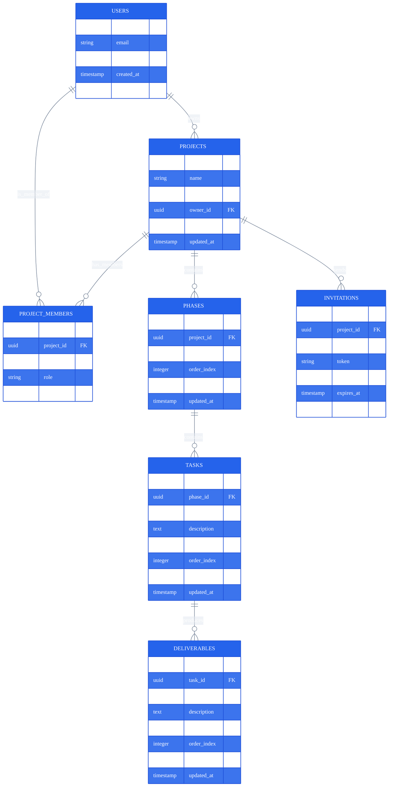
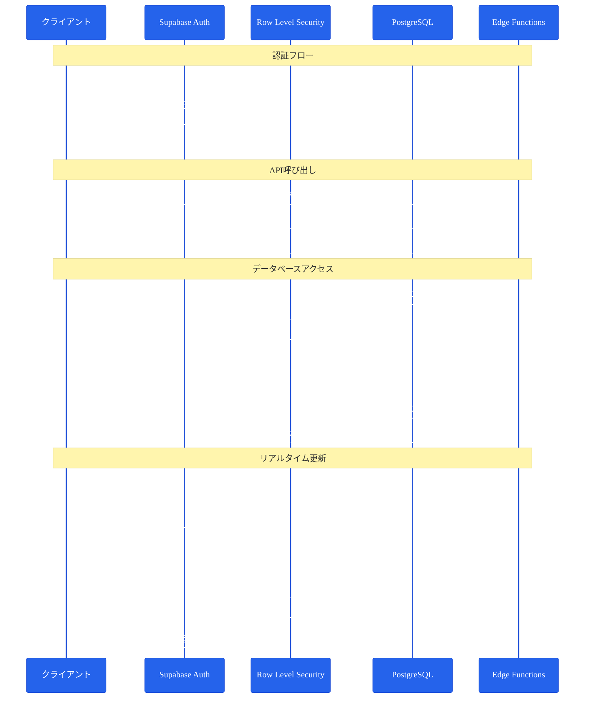
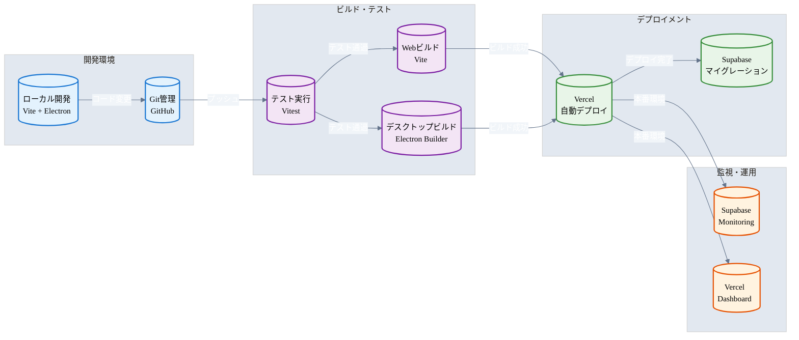
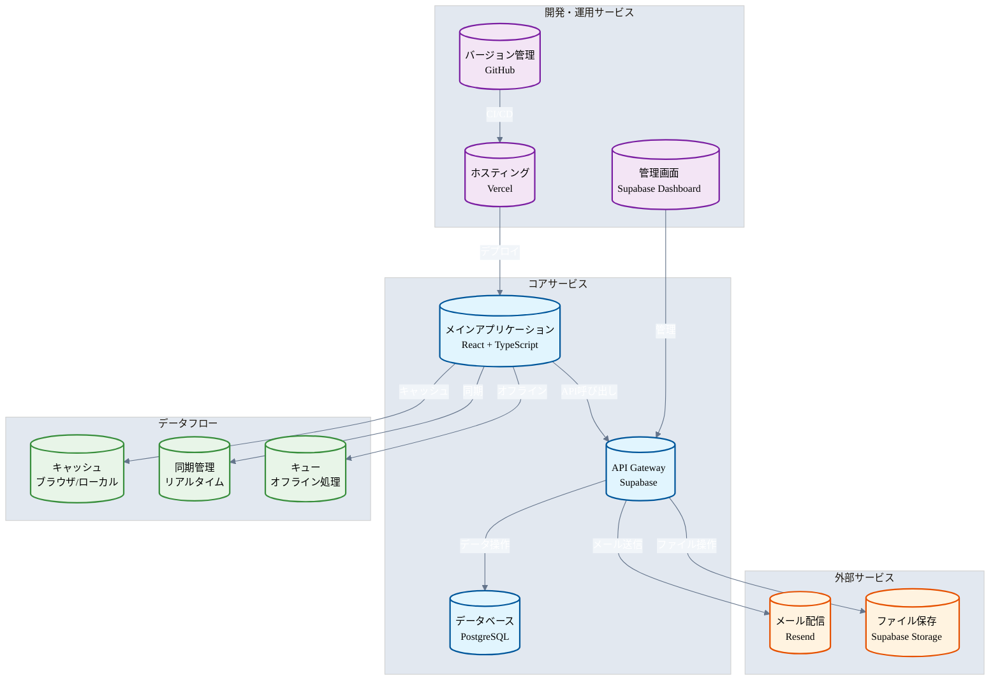
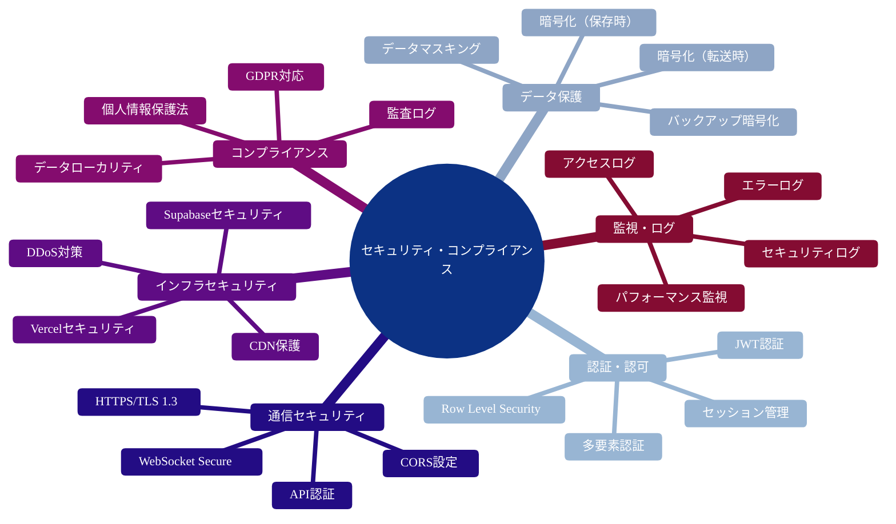
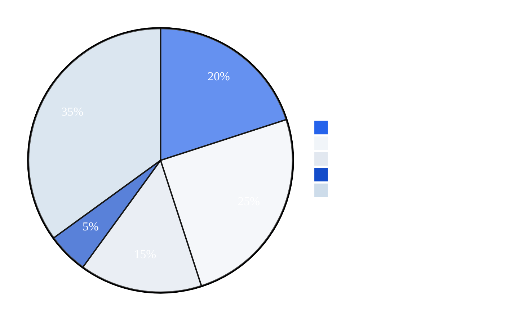

# サービスアーキテクチャ図（実際の使用状況）

## システム全体アーキテクチャ



## データベースアーキテクチャ



## 認証・セキュリティアーキテクチャ



## デプロイメント・CI/CDアーキテクチャ



## サービス連携アーキテクチャ



## セキュリティ・コンプライアンス



## コスト構造



## 📋 実際の使用サービス一覧

| サービス | 用途 | 設定ファイル | パッケージ |
|----------|------|-------------|-----------|
| **Vercel** | ホスティング・デプロイメント | `vercel.json` | - |
| **Supabase** | バックエンド・データベース | `lib/supabase.ts` | `@supabase/supabase-js` |
| **Resend** | メール配信 | `supabase/functions/send-email/` | - |

## 🔧 環境変数設定

```bash
# Supabase設定
VITE_SUPABASE_URL=your_supabase_url
VITE_SUPABASE_ANON_KEY=your_supabase_anon_key

# Resend設定（メール送信機能）
VITE_RESEND_API_KEY=your_resend_api_key
VITE_FROM_EMAIL=onboarding@resend.dev
VITE_ENABLE_EMAIL_SENDING=true
``` 