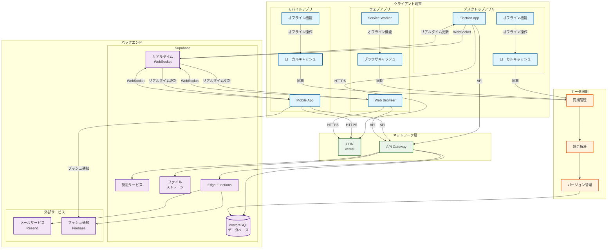
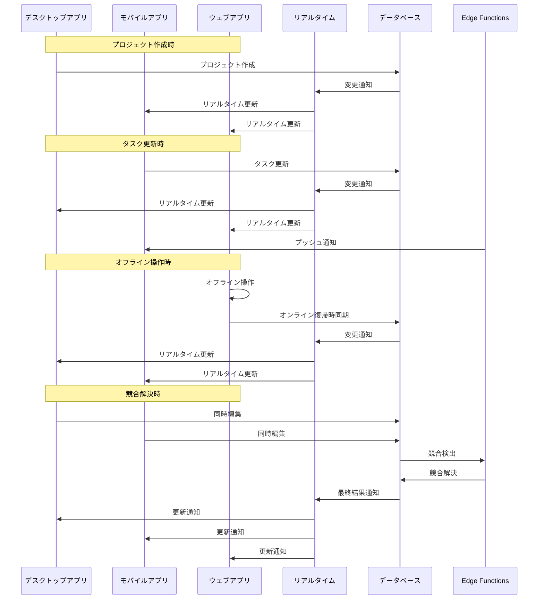
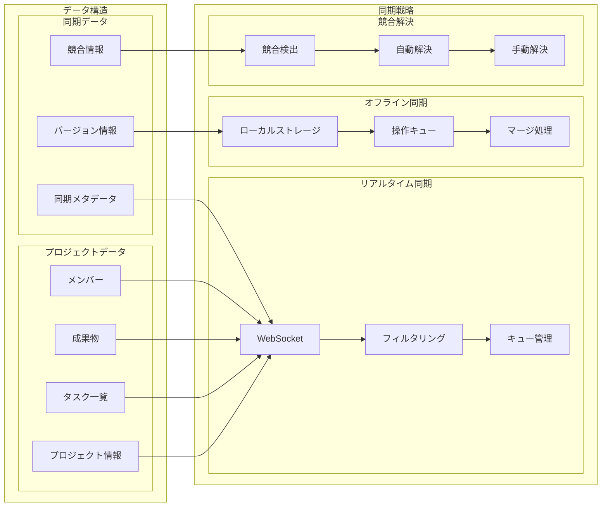
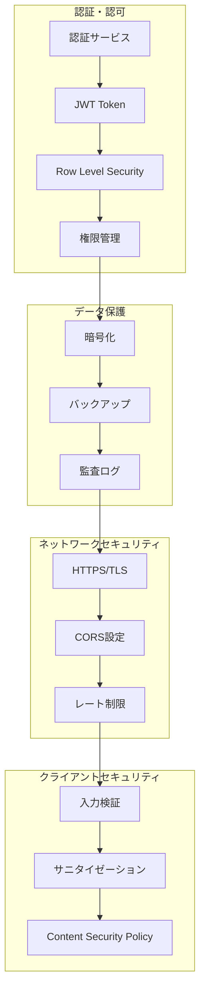
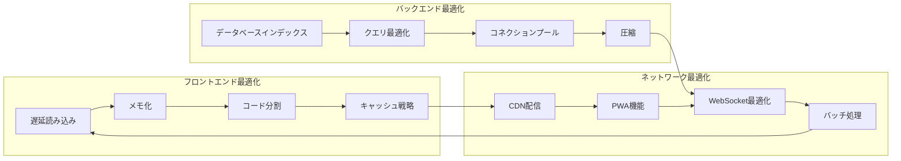
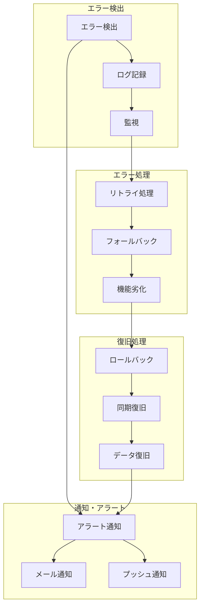

# システム設計アシスタント - データフロー図

## 3端末間のデータ同期フロー

```mermaid
graph TB
    subgraph "クライアント端末"
        subgraph "デスクトップアプリ"
            DA[Electron App]
            DA_Cache[ローカルキャッシュ]
            DA_Offline[オフライン機能]
        end
        
        subgraph "モバイルアプリ"
            MA[Mobile App]
            MA_Cache[ローカルキャッシュ]
            MA_Offline[オフライン機能]
        end
        
        subgraph "ウェブアプリ"
            WA[Web Browser]
            WA_Cache[ブラウザキャッシュ]
            WA_ServiceWorker[Service Worker]
        end
    end
    
    subgraph "ネットワーク層"
        CDN[CDN<br/>Vercel]
        API[API Gateway]
    end
    
    subgraph "バックエンド"
        subgraph "Supabase"
            AUTH[認証サービス]
            DB[(PostgreSQL<br/>データベース)]
            REALTIME[リアルタイム<br/>WebSocket]
            STORAGE[ファイル<br/>ストレージ]
            FUNCTIONS[Edge Functions]
        end
        
        subgraph "外部サービス"
            EMAIL[メールサービス<br/>Resend]
            NOTIFICATION[プッシュ通知<br/>Firebase]
        end
    end
    
    subgraph "データ同期"
        SYNC[同期管理]
        CONFLICT[競合解決]
        VERSION[バージョン管理]
    end
    
    %% デスクトップアプリの接続
    DA -->|HTTPS| CDN
    DA -->|WebSocket| REALTIME
    DA -->|API| API
    DA_Cache -->|同期| SYNC
    DA_Offline -->|オフライン操作| DA_Cache
    
    %% モバイルアプリの接続
    MA -->|HTTPS| CDN
    MA -->|WebSocket| REALTIME
    MA -->|API| API
    MA_Cache -->|同期| SYNC
    MA_Offline -->|オフライン操作| MA_Cache
    MA -->|プッシュ通知| NOTIFICATION
    
    %% ウェブアプリの接続
    WA -->|HTTPS| CDN
    WA -->|WebSocket| REALTIME
    WA -->|API| API
    WA_Cache -->|同期| SYNC
    WA_ServiceWorker -->|オフライン機能| WA_Cache
    
    %% バックエンド処理
    API --> AUTH
    API --> DB
    API --> STORAGE
    API --> FUNCTIONS
    
    %% リアルタイム同期
    REALTIME -->|リアルタイム更新| DA
    REALTIME -->|リアルタイム更新| MA
    REALTIME -->|リアルタイム更新| WA
    
    %% データ同期処理
    SYNC --> CONFLICT
    CONFLICT --> VERSION
    VERSION --> DB
    
    %% 通知・メール
    FUNCTIONS --> EMAIL
    FUNCTIONS --> NOTIFICATION
    
    %% スタイル
    classDef client fill:#e1f5fe,stroke:#01579b,stroke-width:2px
    classDef backend fill:#f3e5f5,stroke:#4a148c,stroke-width:2px
    classDef network fill:#e8f5e8,stroke:#1b5e20,stroke-width:2px
    classDef sync fill:#fff3e0,stroke:#e65100,stroke-width:2px
    
    class DA,DA_Cache,DA_Offline,MA,MA_Cache,MA_Offline,WA,WA_Cache,WA_ServiceWorker client
    class AUTH,DB,REALTIME,STORAGE,FUNCTIONS,EMAIL,NOTIFICATION backend
    class CDN,API network
    class SYNC,CONFLICT,VERSION sync
```

## リアルタイム同期の詳細フロー

```mermaid
sequenceDiagram
    participant DA as デスクトップアプリ
    participant MA as モバイルアプリ
    participant WA as ウェブアプリ
    participant RT as リアルタイム
    participant DB as データベース
    participant FN as Edge Functions
    
    Note over DA,WA: プロジェクト作成時
    
    DA->>DB: プロジェクト作成
    DB->>RT: 変更通知
    RT->>MA: リアルタイム更新
    RT->>WA: リアルタイム更新
    
    Note over DA,WA: タスク更新時
    
    MA->>DB: タスク更新
    DB->>RT: 変更通知
    RT->>DA: リアルタイム更新
    RT->>WA: リアルタイム更新
    FN->>MA: プッシュ通知
    
    Note over DA,WA: オフライン操作時
    
    WA->>WA: オフライン操作
    WA->>DB: オンライン復帰時同期
    DB->>RT: 変更通知
    RT->>DA: リアルタイム更新
    RT->>MA: リアルタイム更新
    
    Note over DA,WA: 競合解決時
    
    DA->>DB: 同時編集
    MA->>DB: 同時編集
    DB->>FN: 競合検出
    FN->>DB: 競合解決
    DB->>RT: 最終結果通知
    RT->>DA: 更新通知
    RT->>MA: 更新通知
    RT->>WA: 更新通知
```

## データ構造と同期戦略

```mermaid
graph LR
    subgraph "データ構造"
        subgraph "プロジェクトデータ"
            PROJ[プロジェクト情報]
            TASKS[タスク一覧]
            DELIV[成果物]
            MEMBERS[メンバー]
        end
        
        subgraph "同期データ"
            SYNC_DATA[同期メタデータ]
            VERSION_DATA[バージョン情報]
            CONFLICT_DATA[競合情報]
        end
    end
    
    subgraph "同期戦略"
        subgraph "リアルタイム同期"
            RT_SYNC[WebSocket]
            RT_FILTER[フィルタリング]
            RT_QUEUE[キュー管理]
        end
        
        subgraph "オフライン同期"
            OFFLINE_SYNC[ローカルストレージ]
            OFFLINE_QUEUE[操作キュー]
            OFFLINE_MERGE[マージ処理]
        end
        
        subgraph "競合解決"
            CONFLICT_DETECT[競合検出]
            CONFLICT_RESOLVE[自動解決]
            CONFLICT_MANUAL[手動解決]
        end
    end
    
    PROJ --> RT_SYNC
    TASKS --> RT_SYNC
    DELIV --> RT_SYNC
    MEMBERS --> RT_SYNC
    
    RT_SYNC --> RT_FILTER
    RT_FILTER --> RT_QUEUE
    
    OFFLINE_SYNC --> OFFLINE_QUEUE
    OFFLINE_QUEUE --> OFFLINE_MERGE
    
    CONFLICT_DETECT --> CONFLICT_RESOLVE
    CONFLICT_RESOLVE --> CONFLICT_MANUAL
    
    SYNC_DATA --> RT_SYNC
    VERSION_DATA --> OFFLINE_SYNC
    CONFLICT_DATA --> CONFLICT_DETECT
```

## セキュリティとアクセス制御

```mermaid
graph TB
    subgraph "認証・認可"
        AUTH[認証サービス]
        RLS[Row Level Security]
        JWT[JWT Token]
        PERM[権限管理]
    end
    
    subgraph "データ保護"
        ENCRYPT[暗号化]
        BACKUP[バックアップ]
        AUDIT[監査ログ]
    end
    
    subgraph "ネットワークセキュリティ"
        HTTPS[HTTPS/TLS]
        CORS[CORS設定]
        RATE_LIMIT[レート制限]
    end
    
    subgraph "クライアントセキュリティ"
        VALIDATION[入力検証]
        SANITIZE[サニタイゼーション]
        CSP[Content Security Policy]
    end
    
    AUTH --> JWT
    JWT --> RLS
    RLS --> PERM
    
    ENCRYPT --> BACKUP
    BACKUP --> AUDIT
    
    HTTPS --> CORS
    CORS --> RATE_LIMIT
    
    VALIDATION --> SANITIZE
    SANITIZE --> CSP
    
    PERM --> ENCRYPT
    AUDIT --> HTTPS
    RATE_LIMIT --> VALIDATION
```

## パフォーマンス最適化

```mermaid
graph LR
    subgraph "フロントエンド最適化"
        LAZY[遅延読み込み]
        MEMO[メモ化]
        BUNDLE[コード分割]
        CACHE[キャッシュ戦略]
    end
    
    subgraph "バックエンド最適化"
        INDEX[データベースインデックス]
        QUERY[クエリ最適化]
        CONNECTION[コネクションプール]
        COMPRESSION[圧縮]
    end
    
    subgraph "ネットワーク最適化"
        CDN[CDN配信]
        PWA[PWA機能]
        WEBSOCKET[WebSocket最適化]
        BATCH[バッチ処理]
    end
    
    LAZY --> MEMO
    MEMO --> BUNDLE
    BUNDLE --> CACHE
    
    INDEX --> QUERY
    QUERY --> CONNECTION
    CONNECTION --> COMPRESSION
    
    CDN --> PWA
    PWA --> WEBSOCKET
    WEBSOCKET --> BATCH
    
    CACHE --> CDN
    COMPRESSION --> WEBSOCKET
    BATCH --> LAZY
```

## エラーハンドリングと復旧

```mermaid
graph TB
    subgraph "エラー検出"
        ERROR_DETECT[エラー検出]
        LOGGING[ログ記録]
        MONITORING[監視]
    end
    
    subgraph "エラー処理"
        RETRY[リトライ処理]
        FALLBACK[フォールバック]
        DEGRADE[機能劣化]
    end
    
    subgraph "復旧処理"
        ROLLBACK[ロールバック]
        SYNC_RECOVERY[同期復旧]
        DATA_RECOVERY[データ復旧]
    end
    
    subgraph "通知・アラート"
        ALERT[アラート通知]
        EMAIL_NOTIFY[メール通知]
        PUSH_NOTIFY[プッシュ通知]
    end
    
    ERROR_DETECT --> LOGGING
    LOGGING --> MONITORING
    
    MONITORING --> RETRY
    RETRY --> FALLBACK
    FALLBACK --> DEGRADE
    
    DEGRADE --> ROLLBACK
    ROLLBACK --> SYNC_RECOVERY
    SYNC_RECOVERY --> DATA_RECOVERY
    
    ERROR_DETECT --> ALERT
    ALERT --> EMAIL_NOTIFY
    ALERT --> PUSH_NOTIFY
    
    DATA_RECOVERY --> ALERT
``` 